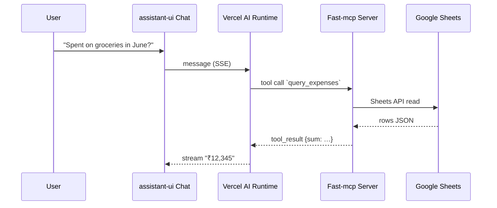

# 📌 Project Overview

**Github Repo Name**: `mcp-finance-assistant`

**Description**: Lightweight finance‑chat assistant that connects to a Google Sheet of personal expenses via an **MCP (Model‑Context‑Protocol) server**, letting users ask questions and receive text, Mermaid diagrams, or interactive charts directly in a web chat UI.

**Type**: Web App (Next.js + assistant‑ui) & CLI‑First MCP Server (FastAPI)

**Goal**: Provide a *single‑evening* MVP that lets a user type: “Show me a pie chart of July spending” and instantaneously receive an answer—using AI reasoning, Google Sheets data retrieval, and rich visualisation—with *zero vendor lock‑in*.

---

## Core Objectives

* **Ship fast** – deliver a usable demo in ≤ 48 hrs (with AI‑assisted coding).
* **MCP‑first interoperability** – back‑end tools discoverable by any MCP‑compatible agent (Claude CLI, Gemini CLI, etc.).
* **Rich answers** – support Markdown, Mermaid diagrams, and React‑based charts in chat.
* **Minimal infra** – free/cheap tiers: Vercel Edge, Fly.io, Google Sheets API.
* **LLM agnostic** – work with GPT‑4o, Claude‑3, Gemini 1.5.

Success = User can ask three canonical questions and get correct + visual replies:

1. “Total spent this month?” → number.
2. “Breakdown by category as bar chart.”
3. “Draw a flowchart of my salary‑to‑expense pipeline.”

---

# 🔍 Competitive Landscape / Existing Solutions

| Product / Tool  | Description                                                               | Link                                                 |
| --------------- | ------------------------------------------------------------------------- | ---------------------------------------------------- |
| Tiller Money    | Links bank feeds to Google Sheets; no chat or AI                          | [https://www.tillerhq.com](https://www.tillerhq.com) |
| ChatGPT Plugins | Can read spreadsheets via Code Interpreter; no live link, no charts in UI | [https://openai.com](https://openai.com)             |
| SheetAI         | Google Sheets add‑on for GPT formulas; no conversational UI               | [https://sheetai.app](https://sheetai.app)           |

📝 **Observations**:

* None of the above expose an *MCP server* → can’t be orchestrated by agentic tooling.
* Existing chatbots lack inline Mermaid + interactive React charts.
* Our approach is chat‑first, protocol‑first, easily embeddable.

---

# 🧭 Use Cases / User Stories

* **Budgeting Ben** wants to *ask natural‑language queries* against his expense sheet so that he can avoid manual pivot tables.
* **Data‑viz Dana** wants on‑the‑fly *pie / line charts* to quickly spot overspending categories.
* **Developer Dev** wants an *MCP toolset* he can reuse in Cursor/Claude Code to automate monthly report emails.

---

## 3. Key Features

1. **Expense Query Tool (**\`\`**)** – SQL‑like filter (date, category, sum, avg).
2. **Chart Tool (**\`\`**)** – Returns JSON series; client renders with Recharts.
3. **Diagram Tool (**\`\`**)** – Generates Mermaid diagram text; validated before sending.
4. **Chat UI** – assistant‑ui `Thread` component with streaming.
5. **LLM Agent** – Vercel AI SDK runtime with auto‑tool selection.
6. **Auth (optional)** – basic HTTP auth on MCP for now.

---

# 🧱 Tech Stack (Proposed)

| Layer        | Tool / Library                                             | Notes                       |
| ------------ | ---------------------------------------------------------- | --------------------------- |
| Front‑end    | **Next.js 15**, **assistant‑ui**, **Tailwind + shadcn/ui** | Fast chat UI, streaming SSE |
| Back‑end     | **FastAPI** + **fast‑mcp**                                 | Rapid MCP scaffolding       |
| Data         | **Google Sheets API v4**                                   | Existing sheet = “Expenses” |
| Charts       | **Recharts** (fallback QuickChart static PNG)              | Interactive within React    |
| Diagrams     | **MermaidJS** + `mermaid.parse` validation                 | Auto‑render in assistant‑ui |
| Orchestrator | **Vercel AI SDK** (`experimental_createMCPClient`)         | Edge‑ready, streaming       |
| Hosting      | Vercel (web) • Fly.io (MCP server)                         | Free tiers                  |
| Auth         | Basic Auth header (MCP)                                    | Good enough for MVP         |

🔗 **Stack Resources**:

* fast‑mcp: [https://github.com/prompt-engineering/fast-mcp](https://github.com/prompt-engineering/fast-mcp)
* assistant‑ui: [https://github.com/assistant-ui/assistant-ui](https://github.com/assistant-ui/assistant-ui)
* Vercel AI SDK: [https://sdk.vercel.ai](https://sdk.vercel.ai)

---

## Screens / UI Views

### 1. Chat Screen (Root)

* **Purpose**: Single interface for asking questions & viewing answers.
* **Components**:

  * `Thread` (assistant‑ui)
  * MessageInput (shadcn/ui `Input` + `Button`)
* **Prompt to design**: “Design a minimalist ChatGPT‑style page with full‑height flex column: header ‘Finance Assistant’, chat area (scroll), sticky input bar at bottom. Use Tailwind & shadcn.\”

### 2. Chart Modal (auto‑rendered)

* **Purpose**: Display interactive Recharts component.
* **Components**: LineChart/PieChart, legend, close button.
* **Prompt**: “Create a centered modal overlay that renders a Recharts `<LineChart>` with data props, dark‑mode aware.”

### 3. Error Toasts

* **Purpose**: Show LLM/MCP errors (quota, syntax).
* **Components**: shadcn/ui `Toast`.

*No separate pages needed for MVP.*

---

## Architecture Notes

* **Edge‑first**: `/api/chat` route runs on Vercel Edge → low latency.
* **State**: assistant‑ui runtime keeps message list; no global store.
* **Sheets Adapter**: Google Service Account JSON key stored as Vercel secret; FastAPI reads with `gspread`.
* **Mermaid Validation**: MCP server runs `mermaid.parse()` before returning diagram; on failure returns error for re‑prompt.
* **LLM Calls**: `streamText` with `temperature=0.2`, tools array injected.

---

## Integrations

* Google Sheets API (read‑only)
* Vercel KV (optional caching)
* fast‑mcp OpenAPI for tool discovery

---

## User Management

* None for MVP; single‑user sheet. HTTP Basic auth protects MCP route.

---

## Billing Strategy

* *Out of scope* for MVP; future Stripe paywall if needed.

---

## Database Strategy

* None – Google Sheets is source‑of‑truth.

---

## MVP Plan / Phase wise Milestones

| Phase                            | Duration | Deliverables                                                             |
| -------------------------------- | -------- | ------------------------------------------------------------------------ |
| **P0 – Repo & Infra**            | 2 hrs    | Git mono‑repo, Vercel + Fly.io projects, `.env` stubs.                   |
| **P1 – MCP Server Skeleton**     | 4 hrs    | FastAPI + fast‑mcp, `query_expenses` returns stub JSON. CLI test passes. |
| **P2 – Google Sheets Live Data** | 4 hrs    | Service account auth, real sheet read, unit tests with VCR.              |
| **P3 – LLM Tooling Smoke**       | 3 hrs    | Claude CLI chat returns correct sum using tool.                          |
| **P4 – Web Chat Alpha**          | 4 hrs    | Next.js page with assistant‑ui streaming plain text.                     |
| **P5 – Visuals & Validation**    | 4 hrs    | Recharts tool UI, MermaidDiagram plugin, validator loop.                 |
| **P6 – Polish & Deploy**         | 4 hrs    | Env secrets, Basic auth, public demo URL, README gif.                    |

*Total ≈ 25 hrs (can be fit into two focused evenings with AI pair‑coding).* 

---

## Open Questions

* Should we cache Google Sheet rows in KV to avoid quota hits?
* Which LLM key is easiest for contributors (OpenAI vs Anthropic)?
* Do we need auth UI early, or postpone to v0.2?
* Is QuickChart static PNG fallback necessary or can Recharts cover 100%?
* What licence (MIT vs AGPL) fits MCP tool ecosystem expectations?

---

# 📎 Appendix

### Mermaid – Data Flow (detailed)

---

*Maintainers: Sunny Dsouza, ChatGPT — v0.2, {{date}}*

